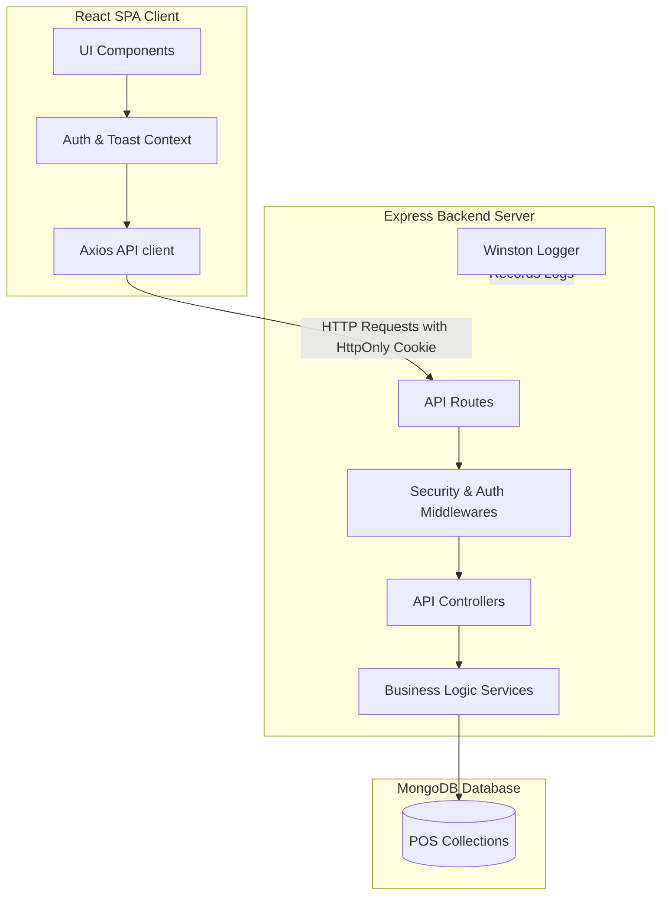
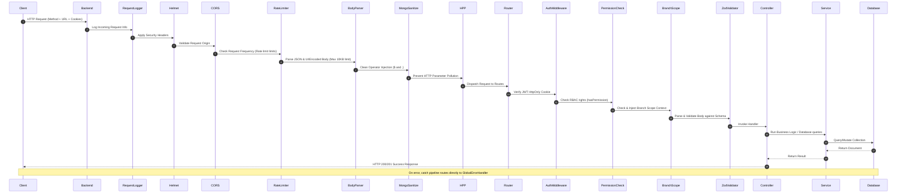
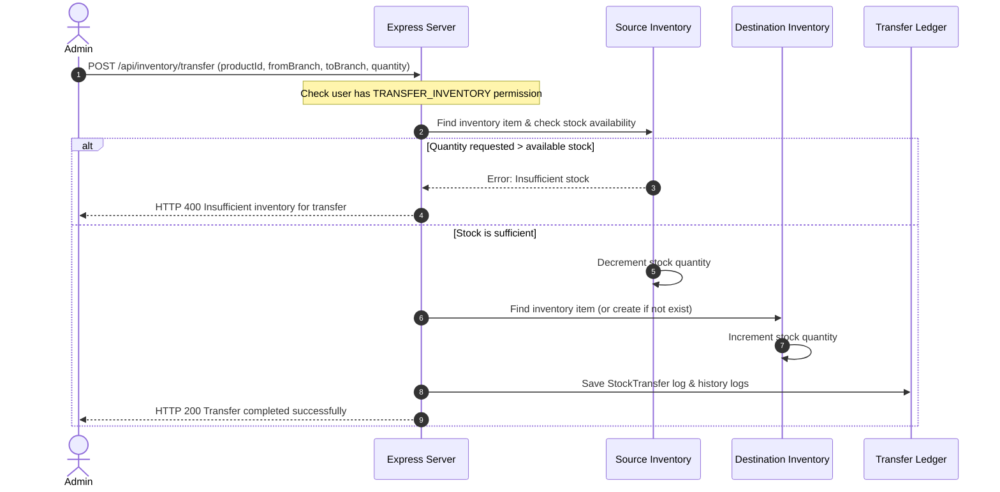
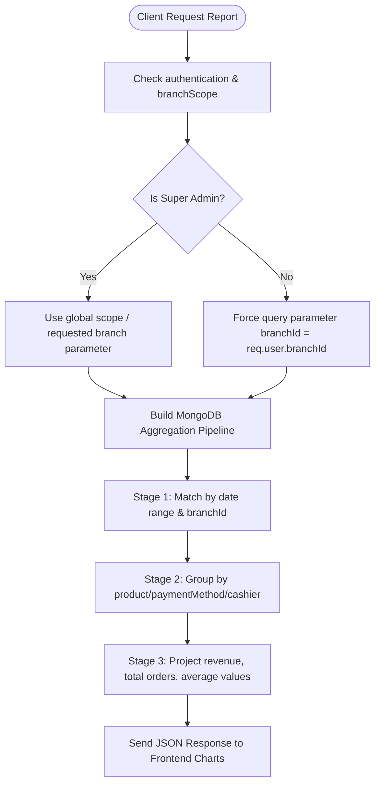

# Architecture Design Document

This document outlines the technical architecture, data schemas, transaction workflows, and security models of the **POS & Inventory Authentication System**.

---

## 1. High-Level Architecture
The application follows a standard **Client-Server-Database** architecture pattern. It separation of concerns into a single-page React frontend, an Express-based REST API backend, and a MongoDB database cluster.



---

## 2. Frontend Architecture
The React application is built on top of **Vite** and organized into modular directories. 
- **Context API (`AuthContext`, `ToastContext`)**: Manages global shared states (current user details, toast notification triggers).
- **Custom Hooks (`useAuth`, `useToast`)**: Abstract state usage inside UI screens.
- **Service Layer (`api.js`)**: Encapsulates Axios configurations, setting `withCredentials: true` to handle cookies.
- **Routing Shell (`App.jsx`)**: Declares browser routes using `react-router-dom`. Includes `ProtectedRoute` (redirects unauthenticated users to `/`) and `GuestRoute` (redirects active users away from login pages).
- **Sub-Views switching**: Controlled inside the `Dashboard.jsx` controller shell by syncing tab names to the browser query parameters (`?tab=billing`, `?tab=inventory`), which preserves tab states on refresh.

---

## 3. Backend Architecture
The backend is a Node.js server powered by Express:
- **Server Entry (`server.js`)**: Configures express middlewares, applies security headers, links routes, establishes connection to database, and initiates graceful shutdown events.
- **Controllers Layer**: Express request/response interfaces. They invoke Zod schema parse controls on incoming bodies, execute service methods, and handle success responses.
- **Services Layer**: Pure business logic modules. Performs database mutations, triggers history logging, manages transactions, and returns clean objects to controllers.
- **Models Layer**: Mongoose schemas enforcing field validations, pre-save hashing hooks, and database indexing.

### Folder Structure Overview
```
├── backend/
│   ├── config/             # DB connection, Winston logger configuration, static roles/permissions mapping
│   ├── constants/          # Static role IDs, lockouts, password blacklists
│   ├── controllers/        # Request handling and Zod parsing triggers
│   ├── middleware/         # Auth verification, RBAC permissions, error formatting, rate limits
│   ├── models/             # Mongoose schemas & indexing rules
│   ├── routes/             # Express routing mapping endpoints to controllers
│   ├── services/           # Core business logic layer
│   ├── utils/              # Response formatting, async helper functions
│   └── validators/         # Zod validator definitions
└── frontend/
    └── src/
        ├── components/     # Reusable inputs, buttons, tables, routing guards
        ├── context/        # React Context objects
        ├── hooks/          # Hooks for state access
        ├── pages/          # Layout shells and tab-based sub-views
        └── services/       # Axios API client setups
```

---

## 4. Request Lifecycle

The backend handles client requests via an ordered pipeline of security, body-parsing, and routing middlewares:



---

## 5. Security Architecture

Our security structure implements multi-layered protections:

- **JWT Session Security**: Authentication states are managed statelessly on the backend and stored in a secure, `HttpOnly` and `SameSite=Lax` cookie, preventing client-side JavaScript from accessing or reading the token (mitigating XSS session theft).
- **Stateless Logout / Password Change Invalidation**: When a user updates their password, a `passwordChangedAt` timestamp is written. When processing subsequent requests, the auth middleware compares this to the JWT `iat` (issued at) time. If the token was issued *before* the password update, it is rejected as invalid, forcing logout of all other active sessions.
- **Failed Logins & Brute Force Protection**: Standard lockout rules limit users to 5 failed login attempts. Once exceeded, `accountLockedUntil` is populated, locking the account for 15 minutes.
- **Input Sanitization**: `express-mongo-sanitize` actively removes keys prefixing with `$` or containing `.` from query and request bodies to block NoSQL Injection attacks.
- **Header Hardening**: `helmet` blocks MIME-sniffing, clickjacking, and injects safe transport headers.
- **Size-Bounded Parsing**: Request parsers restrict JSON payload structures to `10kb` to avoid server buffer exhaustion attacks.
- **Graceful Shutdown**: Intercepts terminal events (`SIGINT`/`SIGTERM`) and stops listening to incoming connections. It waits for active transactions to complete before closing the MongoDB connection.

---

## 6. Database Architecture

### MongoDB Collections Reference

#### 1. Users (`users` collection)
- **Purpose**: Authenticated user accounts, session tracking, and role histories.
- **Important Fields**:
  - `username` (String, unique, indexed, trim, lowercase, minlength 4, maxlength 20)
  - `email` (String, unique, indexed, trim, lowercase)
  - `password` (String, hashed)
  - `role` (String: `SUPER_ADMIN`, `ADMIN`, `CASHIER`)
  - `branchId` (ObjectId referencing `Branch`, index)
  - `status` (String: `PENDING`, `ACTIVE`, `INACTIVE`, `SUSPENDED`)
  - `isDeleted` (Boolean, default false, indexed)
  - `failedLoginAttempts` (Number, default 0)
  - `accountLockedUntil` (Date, default null)
  - `loginHistory` (Array of subdocuments: `ipAddress`, `userAgent`, `loginTime`)
- **Indexes**:
  - `{ username: 1 }` (unique)
  - `{ email: 1 }` (unique)
  - `{ branchId: 1 }`
  - `{ status: 1 }`
  - `{ isDeleted: 1 }`
- **Relationships**:
  - `branchId` → `Branch` (1:1 optional relationship)
  - `createdBy`, `approvedBy`, `rejectedBy` → `User` (Audit links)
- **Validation**: Strict format constraints for email and length criteria for usernames.
- **Example Document**:
```json
{
  "_id": "603d274f1f50a830200845a1",
  "username": "cashier_johndoe",
  "name": "John Doe",
  "email": "johndoe@example.com",
  "phone": "+1234567890",
  "password": "$2b$12$XYZ123ABC456...",
  "role": "CASHIER",
  "branchId": "603d274f1f50a830200845a0",
  "status": "ACTIVE",
  "isDeleted": false,
  "failedLoginAttempts": 0,
  "hasIngredientsAccess": true,
  "loginHistory": [
    { "ipAddress": "127.0.0.1", "userAgent": "Mozilla/5.0...", "loginTime": "2026-07-14T05:00:00Z" }
  ],
  "createdAt": "2026-07-14T04:00:00.000Z",
  "updatedAt": "2026-07-14T05:00:00.000Z"
}
```

#### 2. Branches (`branches` collection)
- **Purpose**: Physical retail POS locations.
- **Important Fields**:
  - `name` (String, required)
  - `branchCode` (String, required, unique, uppercase, indexed)
  - `status` (String: `ACTIVE`, `INACTIVE`)
  - `isDeleted` (Boolean, default false)
- **Indexes**:
  - `{ branchCode: 1 }` (unique)
- **Example Document**:
```json
{
  "_id": "603d274f1f50a830200845a0",
  "name": "Downtown Outlet",
  "branchCode": "DTN01",
  "phone": "555-0199",
  "email": "downtown@example.com",
  "address": "123 Main St",
  "city": "Metropolis",
  "state": "NY",
  "country": "USA",
  "pincode": "10001",
  "managerName": "Jane Smith",
  "status": "ACTIVE",
  "isDeleted": false,
  "createdAt": "2026-07-14T01:00:00.000Z"
}
```

#### 3. Categories (`categories` collection)
- **Purpose**: POS product catalogs category folders.
- **Important Fields**:
  - `branchId` (ObjectId referencing `Branch`)
  - `name` (String, required, trim)
  - `isActive` (Boolean, default true)
- **Indexes**:
  - `{ branchId: 1, name: 1 }` (unique compound index - unique category names per branch)
  - `{ isActive: 1 }`
- **Example Document**:
```json
{
  "_id": "603d274f1f50a830200845a2",
  "branchId": "603d274f1f50a830200845a0",
  "name": "Beverages",
  "description": "Hot and cold drinks",
  "displayOrder": 1,
  "isActive": true,
  "createdBy": "603d274f1f50a830200845b9",
  "updatedBy": "603d274f1f50a830200845b9"
}
```

#### 4. Products (`products` collection)
- **Purpose**: Master catalog of menu items, combos, and size variants.
- **Important Fields**:
  - `branchId` (ObjectId referencing `Branch`)
  - `categoryId` (ObjectId referencing `Category`)
  - `name` (String, required)
  - `sku` (String, required)
  - `barcode` (String)
  - `price` (Number, base price)
  - `taxPercentage` (Number, default 0)
  - `variants` (Array of schemas: `name`, `price`, `isDefault`, `isActive`)
  - `isCombo` (Boolean, default false)
  - `comboItems` (Array of ObjectIds referencing `Product`)
  - `status` (String: `ACTIVE`, `INACTIVE`)
- **Indexes**:
  - `{ branchId: 1, sku: 1 }` (unique compound)
  - `{ branchId: 1, categoryId: 1, name: 1 }` (unique compound)
  - `{ branchId: 1, barcode: 1 }` (unique partial index)
  - `{ categoryId: 1 }`
- **Example Document**:
```json
{
  "_id": "603d274f1f50a830200845a3",
  "branchId": "603d274f1f50a830200845a0",
  "categoryId": "603d274f1f50a830200845a2",
  "name": "Cappuccino",
  "sku": "CAP-01",
  "price": 3.99,
  "taxPercentage": 8,
  "variants": [
    { "name": "Regular", "price": 3.99, "isDefault": true, "isActive": true },
    { "name": "Large", "price": 4.99, "isDefault": false, "isActive": true }
  ],
  "isCombo": false,
  "status": "ACTIVE"
}
```

#### 5. Inventory (`inventories` collection)
- **Purpose**: Real-time product physical stock levels.
- **Important Fields**:
  - `productId` (ObjectId referencing `Product`)
  - `branchId` (ObjectId referencing `Branch`)
  - `quantity` (Number, cannot be negative)
  - `threshold` (Number, reorder alert limit)
  - `unit` (String, e.g., "units", "pcs")
- **Indexes**:
  - `{ branchId: 1, productId: 1 }` (unique compound index - 1 record per product per branch)
- **Example Document**:
```json
{
  "_id": "603d274f1f50a830200845a4",
  "productId": "603d274f1f50a830200845a3",
  "branchId": "603d274f1f50a830200845a0",
  "quantity": 120,
  "threshold": 15,
  "unit": "cups",
  "createdBy": "603d274f1f50a830200845b9",
  "updatedBy": "603d274f1f50a830200845b9"
}
```

#### 6. Inventory History (`inventoryhistories` collection)
- **Purpose**: Transaction ledger logging every product inventory modification.
- **Important Fields**:
  - `inventoryId` (ObjectId referencing `Inventory`)
  - `productId` (ObjectId referencing `Product`)
  - `action` (String: `RESTOCK`, `SALE`, `ADJUSTMENT`, `TRANSFER_IN`, `TRANSFER_OUT`)
  - `quantity` (Number, amount changed)
  - `previousQuantity` (Number)
  - `newQuantity` (Number)
  - `userId` (ObjectId referencing `User`)
  - `branchId` (ObjectId referencing `Branch`)
- **Example Document**:
```json
{
  "_id": "603d274f1f50a830200845a5",
  "inventoryId": "603d274f1f50a830200845a4",
  "productId": "603d274f1f50a830200845a3",
  "action": "RESTOCK",
  "quantity": 50,
  "previousQuantity": 70,
  "newQuantity": 120,
  "userId": "603d274f1f50a830200845b9",
  "branchId": "603d274f1f50a830200845a0",
  "notes": "Weekly supply restock",
  "invoiceNumber": "INV-8910",
  "timestamp": "2026-07-14T06:00:00Z"
}
```

#### 7. Orders & Payments (`orders` collection)
- **Purpose**: Checkout orders metadata, itemized receipts, and payment method arrays.
- **Important Fields**:
  - `orderNumber` (String, unique, indexed)
  - `customerId` (ObjectId referencing `Customer`, optional)
  - `branchId` (ObjectId referencing `Branch`)
  - `cashierId` (ObjectId referencing `User`)
  - `items` (Array: `productId`, `name`, `quantity`, `unitPrice`, `totalPrice`, `variantName`)
  - `subtotal` (Number)
  - `totalAmount` (Number)
  - `status` (String: `HOLD`, `COMPLETED`, `CANCELLED`, `VOID`, `REFUNDED`)
  - `paymentStatus` (String: `PAID`, `PENDING`, `REFUNDED`)
  - `paymentMethods` (Array of subdocuments: `method` ['CASH', 'CARD', 'UPI'], `amount`, `referenceNumber`)
- **Indexes**:
  - `{ orderNumber: 1 }` (unique)
  - `{ branchId: 1, orderDate: -1 }` (compound)
  - `{ orderDate: -1, status: 1 }` (compound)
- **Example Document**:
```json
{
  "_id": "603d274f1f50a830200845a6",
  "orderNumber": "ORD-20260714-001",
  "customerId": "603d274f1f50a830200845a9",
  "customerName": "Jane Miller",
  "branchId": "603d274f1f50a830200845a0",
  "cashierId": "603d274f1f50a830200845a1",
  "items": [
    {
      "productId": "603d274f1f50a830200845a3",
      "name": "Cappuccino",
      "quantity": 2,
      "unitPrice": 4.99,
      "totalPrice": 9.98,
      "variantName": "Large"
    }
  ],
  "subtotal": 9.98,
  "totalAmount": 10.78,
  "paymentStatus": "PAID",
  "status": "COMPLETED",
  "paymentMethods": [
    { "method": "CARD", "amount": 10.78, "referenceNumber": "TXN-8812" }
  ],
  "orderDate": "2026-07-14T08:30:00Z"
}
```

#### 8. Stock Transfers (`stocktransfers` collection)
- **Purpose**: Inter-branch stock allocation tracking.
- **Important Fields**:
  - `fromBranch` (ObjectId referencing `Branch`)
  - `toBranch` (ObjectId referencing `Branch`)
  - `productId` (ObjectId referencing `Product`)
  - `quantity` (Number)
  - `transferredBy` (ObjectId referencing `User`)
  - `status` (String: `PENDING`, `APPROVED`, `REJECTED`, default: `APPROVED`)
- **Example Document**:
```json
{
  "_id": "603d274f1f50a830200845a7",
  "fromBranch": "603d274f1f50a830200845a0",
  "toBranch": "603d274f1f50a830200845f2",
  "productId": "603d274f1f50a830200845a3",
  "quantity": 10,
  "transferredBy": "603d274f1f50a830200845b9",
  "status": "APPROVED",
  "createdAt": "2026-07-14T09:00:00Z"
}
```

#### 9. Audit Logs (`auditlogs` collection)
- **Purpose**: Tamper-proof, immutable ledger tracking user administrative actions.
- **Important Fields**:
  - `performedBy` / `actor` (ObjectId referencing `User`)
  - `performedByRole` (String)
  - `action` (String)
  - `entityType` (String)
  - `entityId` (ObjectId)
  - `branchId` (ObjectId, optional)
- **Mongoose Enforced Protections**:
  - Block modifications or deletions on saving (`isNew` enforcement).
  - Pre-hooks block standard mutation commands (`updateOne`, `updateMany`, `deleteOne`, etc.).
- **Indexes**:
  - `{ timestamp: -1 }`
  - `{ branchId: 1, timestamp: -1 }`
  - `{ performedBy: 1, timestamp: -1 }`
- **Example Document**:
```json
{
  "_id": "603d274f1f50a830200845a8",
  "performedBy": "603d274f1f50a830200845b9",
  "actor": "603d274f1f50a830200845b9",
  "performedByRole": "SUPER_ADMIN",
  "action": "USER_APPROVED",
  "entityType": "User",
  "entityId": "603d274f1f50a830200845a1",
  "ipAddress": "127.0.0.1",
  "userAgent": "Mozilla/5.0...",
  "timestamp": "2026-07-14T04:15:00Z"
}
```

---

## 7. Key Transaction Workflows

### Inventory Stock Transfer Sequence
Allows transferring product stock from a source branch (`fromBranch`) to a target branch (`toBranch`):



### Report Generation Flow
Aggregates sales performance by writing custom aggregate filters:



---

## 8. Scalability & Deployment Architecture

### Current Deployment Setup
The application is ready to deploy containerized via **Docker** and **Docker Compose**:
- **Backend Container**: Run with PM2 or Node runtime, scale up by mounting to clusters.
- **Frontend Container**: Nginx server serving Vite build directories.
- **Database**: Single MongoDB Instance or MongoDB Atlas cluster.

### Future Scaling Strategy
If the system grows to hundreds of branches, the following scale-out paths should be implemented:

1. **Database Sharding**: Shard the MongoDB cluster using `branchId` as the shard key. Because 99% of transactions are branch-specific (POS checkout, adjustments), this ensures query execution remains localized to individual shards without cross-shard network overhead.
2. **Read/Write Splitting**: Route analytical reports and CSV exports to MongoDB read replicas, while transaction writes (checkouts, transfers) hit the primary node directly, preventing POS delays during heavy report generation.
3. **Caching Layer**: Introduce a Redis cache cluster. Cache active product lists, categories, and branch details locally, invalidating only when admins push catalog updates.
4. **Load Balancing**: Deploy multiple backend node instances behind an Nginx load balancer using sticky sessions (or stateless authorization token validation).
